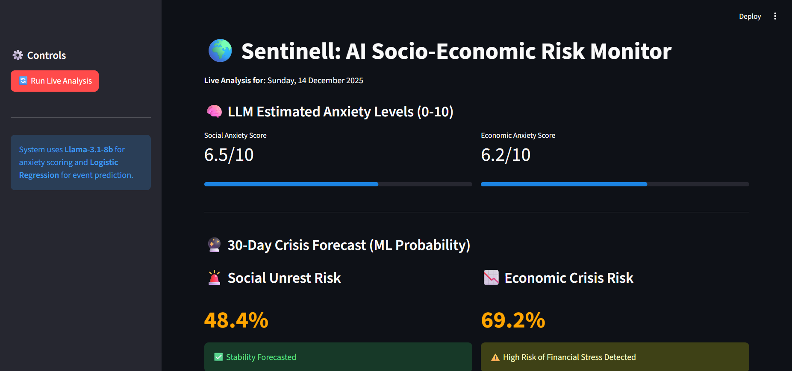

# 🌍 Sentinell: AI-Driven Socio-Economic Risk Forecasting

**Sentinell** is a multimodal forecasting system designed as a Proof-of-Concept (PoC). It predicts the probability of social unrest and economic crises by analyzing news media. The system utilizes a hybrid architecture combining **Semantic Search (Transformer Embeddings)** for signal filtration, **Large Language Models (Llama 3.3-70B via Groq)** for quantitative reasoning, and **Logistic Regression** for predictive analytics.

> **Project Status:** Workshop Material

> **Organization:** Moroccan Mathematical Community (MMC)

> **Host Institution:** INSEA Rabat - Morocco

> **Lead Researcher:** Hamza Ba-mohammed

-----

## 🏗️ Architecture

The system operates on a three-stage pipeline:

1.  **Signal Extraction (The Filter):**

      * Ingests raw unstructured text (News Headlines).
      * Uses **Sentence-BERT** (locally cached in `lab/`) to compute semantic cosine similarity against "Risk Anchors."
      * Filters noise to retain only the top risk-relevant headlines.

2.  **Quantitative Reasoning (The Analyst):**

      * Feeds curated headlines into **Llama 3.3-70B (via Groq API)**.
      * Uses **Chain-of-Thought (CoT)** prompting (defined in `lab/prompt.txt`) to generate calibrated "Anxiety Scores" (0-10).

3.  **Predictive Modeling (The Forecaster):**

      * These scores serve as features for calibrated **Logistic Regression** classifiers stored in `bin/`.
      * Outputs the probability ($P$) of a specific event occurring in the next 30 days.

-----

## 📂 Repository Structure

```text
├── app/
│   └── app.py              # Main Streamlit Dashboard application
├── bin/
│   ├── model_social.pkl    # Pre-trained Logistic Regression (Social Risk)
│   └── model_economic.pkl  # Pre-trained Logistic Regression (Economic Risk)
├── data/
│   ├── ccc_compiled.csv    # Compiled corpus of events
│   ├── DATA.csv            # Raw economic indicators
│   ├── headlines.csv       # Historical news headlines
│   ├── merged_data.csv     # Pre-processed merged dataset
│   └── merged_std_data.csv # Standardized dataset for training
├── lab/
│   ├── data.ipynb          # Notebook for data cleaning
│   ├── llm.ipynb           # Notebook for feature engineering, LLM scoring & model training experiments
│   └── prompt.txt          # The "Role Prompt" and Scoring Rubric
├── .env                    # API Keys (Not committed to Git)
├── reqs.txt                # Python dependencies
└── README.md               # Documentation
```

-----

## 🛠️ Installation & Setup

### 1\. Clone the Repository

```bash
git clone https://github.com/HamBa-m/socio-eco-stress
cd socio-eco-stress
```

### 2\. Install Dependencies

Ensure you have Python 3.9+ installed.

```bash
pip install -r reqs.txt
```

### 3\. Configure API Keys (`.env`)

This project relies on **Groq** for intelligence and **NewsAPI** for live data.
Create a file named `.env` in the **root directory** of the project and add your keys:

```ini
# .env file
GROQ_API_KEY="gsk_..."
NEWS_API_KEY="your_newsapi_key"
HF_TOKEN="your_huggingface_token" 
```

> **Note:** The application logic in `app/app.py` is configured to load these keys automatically using `python-dotenv`.

-----

## 📊 Datasets

The historical data used to train the models (located in the `data/` folder) includes economic indicators, event counts, and aggregated news headlines.

You can download the raw datasets from the following Kaggle and GitHub sources:

  * **ccc_compiled.csv**: [LINK](https://github.com/rexdouglass/crowd-counting-consortium/blob/master/ccc_compiled.csv)
  * **DATA.csv**: [LINK](https://www.kaggle.com/datasets/sagarvarandekar/macroeconomic-factors-affecting-us-housing-prices)
  * **headlines.csv**: [LINK](https://www.kaggle.com/datasets/jordankrishnayah/45m-headlines-from-2007-2022-10-largest-sites?select=headlines.csv)

*After downloading, place the CSV files into the `data/` folder matching the filenames listed in the Structure section above.*

-----

## 🖥️ Usage

### 1\. Running the Live Dashboard

To launch the interactive web interface:

```bash
streamlit run app/app.py
```

*The application will open in your browser at `http://localhost:8501`. It will verify your API keys and load the models from the `bin/` directory.*



### 2\. Retraining Models (Research Lab)

If you wish to modify the training logic or prompt engineering:

  * **Data Processing:** Explore `lab/data.ipynb` to see how raw CSVs are merged and cleaned.
  * **Model Training:** Open `lab/llm.ipynb` to run the semantic filtering pipeline, query the LLM for historical scoring, and fit new Logistic Regression models.
  * **Prompt Tuning:** Edit `lab/prompt.txt` to refine the rubric used by the LLM.

-----

## 📜 License

This project is a workshop material for the IT Academy 2025 event at INSEA Rabat - Morocco, and is open-sourced under the MIT License. See the [LICENSE](LICENSE) file for details.